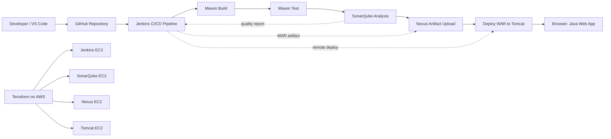

# Java DevSecOps CI/CD Pipeline on AWS

This project documents an end-to-end DevSecOps CI/CD pipeline for a Java Maven web application. The infrastructure was provisioned on AWS with Terraform, Jenkins automated the pipeline, SonarQube performed code quality analysis, Nexus stored the generated WAR artifact, and Apache Tomcat hosted the deployed web application.

The project was not just a successful deployment. It also captured the debugging process: plugin issues, wrong commands, missing credentials, Java version problems, Nexus authentication errors, and Tomcat manager deployment failures. The final result is a working pipeline that builds, tests, analyzes, archives, and deploys the application automatically.

## Architecture



The workflow starts with code pushed to GitHub. Jenkins pulls the repository, builds and tests the Maven web application, sends code analysis to SonarQube, uploads the generated WAR file to Nexus, and finally deploys that WAR file to Apache Tomcat.

## Tools and Technologies

- AWS EC2
- Terraform
- Jenkins
- Maven
- Java
- SonarQube Community Edition
- Sonatype Nexus Repository
- Apache Tomcat 9
- Git and GitHub
- Ubuntu Linux
- VS Code
- PowerShell and Git Bash

## Repository Structure

```text
.
├── JENKINS/              # Terraform files and Jenkins bootstrap script
├── NEXUS/                # Terraform files for Nexus EC2 instance
├── SONAQUBE/             # Terraform files for SonarQube EC2 instance
├── SampleWebApp/         # Maven Java web application
├── tomcat/               # Terraform files and Tomcat bootstrap script
├── Jenkinsfile           # CI/CD pipeline definition
├── .gitignore            # Prevents Terraform state and local files from being committed
└── docs/screenshots/     # Project evidence and troubleshooting screenshots
```

## Infrastructure Provisioning

Terraform was used to provision separate AWS EC2 instances for Jenkins, SonarQube, Nexus, and Tomcat. Each service had its own security group rules based on the ports required for access.

| Service | Main Port | Purpose |
|---|---:|---|
| Jenkins | 8080 | CI/CD automation server |
| SonarQube | 9000 | Code quality and static analysis |
| Nexus | 8081 | Artifact repository |
| Tomcat | 8080 | Java web application runtime |
| SSH | 22 | Server administration |

The Terraform configuration also used the default VPC and default subnet, selected an Ubuntu 20.04 AMI, and attached the `buildkey` SSH key pair to the EC2 instances.

## Jenkins Pipeline

The pipeline is defined in the `Jenkinsfile` and contains five major stages:

1. Build the application with Maven.
2. Run Maven tests.
3. Analyze the project with SonarQube.
4. Upload the WAR artifact to Nexus.
5. Deploy the WAR file to Apache Tomcat.

```groovy
pipeline {
    agent any

    stages {
        stage('Build with Maven') {
            steps {
                sh 'cd SampleWebApp && mvn clean install'
            }
        }

        stage('Test') {
            steps {
                sh 'cd SampleWebApp && mvn test'
            }
        }

        stage('SonarQube Analysis') {
            steps {
                withSonarQubeEnv('SonarQube') {
                    sh '''
                    cd SampleWebApp && mvn org.sonarsource.scanner.maven:sonar-maven-plugin:sonar \
                      -Dsonar.projectKey=SampleWebApp \
                      -Dsonar.projectName=SampleWebApp
                    '''
                }
            }
        }

        stage('Upload Artifact to Nexus') {
            steps {
                nexusArtifactUploader artifacts: [[
                    artifactId: 'SampleWebApp',
                    classifier: '',
                    file: 'SampleWebApp/target/SampleWebApp.war',
                    type: 'war'
                ]],
                credentialsId: 'nexus',
                groupId: 'SampleWebApp',
                nexusUrl: 'NEXUS_PUBLIC_DNS:8081',
                nexusVersion: 'nexus3',
                protocol: 'http',
                repository: 'maven-snapshots',
                version: '1.0-SNAPSHOT'
            }
        }

        stage('Deploy to Tomcat') {
            steps {
                deploy adapters: [
                    tomcat9(
                        alternativeDeploymentContext: '',
                        credentialsId: 'tomcat',
                        path: '',
                        url: 'http://TOMCAT_PUBLIC_IP:8080/'
                    )
                ],
                contextPath: 'myapp',
                war: 'SampleWebApp/target/SampleWebApp.war'
            }
        }
    }
}
```

## Jenkins Plugins Used

The following Jenkins plugins were required:

- SonarQube Scanner
- Nexus Artifact Uploader
- Deploy to container
- Pipeline
- Git


## SonarQube Integration

SonarQube was integrated with Jenkins so that Jenkins could send code analysis results during the pipeline.

The integration required:

- Installing the SonarQube Scanner plugin in Jenkins.
- Creating a SonarQube user token.
- Adding the token to Jenkins as a secret text credential.
- Configuring a SonarQube server in Jenkins global system settings.
- Creating a webhook in SonarQube pointing back to Jenkins.


## Nexus Integration

Nexus was used as the artifact repository. After Maven generated the WAR file, Jenkins uploaded the artifact to the `maven-snapshots` repository using the Nexus Artifact Uploader plugin.

The Nexus upload required:

- Nexus running on port `8081`.
- A Jenkins credential with the ID `nexus`.
- The repository name `maven-snapshots`.
- The generated artifact path: `SampleWebApp/target/SampleWebApp.war`.


## Tomcat Deployment

Apache Tomcat was used to run the deployed Java web application. Jenkins deployed the WAR file remotely through the Tomcat manager endpoint.

The Tomcat deployment required:

- Tomcat running on port `8080`.
- The `tomcat9-admin` package installed.
- A Tomcat user with the `manager-script` role.
- A Jenkins credential with the ID `tomcat`.
- The Jenkins Deploy to container plugin.

The Tomcat user configuration was added to `/etc/tomcat9/tomcat-users.xml`:

```xml
<role rolename="manager-gui"/>
<role rolename="manager-script"/>
<role rolename="admin-gui"/>
<user username="admin" password="REPLACE_WITH_SECURE_PASSWORD" roles="manager-gui,manager-script,admin-gui"/>
```

After updating the file, Tomcat was restarted:

```bash
sudo systemctl restart tomcat9
```


## Final Result

The final Jenkins run completed successfully. The pipeline built the application, ran tests, analyzed the project with SonarQube, uploaded the WAR file to Nexus, and deployed the application to Tomcat.

```text
Build with Maven       SUCCESS
Test                   SUCCESS
SonarQube Analysis     SUCCESS
Upload Artifact Nexus  SUCCESS
Deploy to Tomcat       SUCCESS
```


## Problems Encountered and How I Solved Them

### 1. Terraform Provider Was Missing

When I first ran `terraform validate`, Terraform reported that the AWS provider was missing.

**Cause:** Terraform had not downloaded the required provider plugin yet.

**Fix:** I ran:

```bash
terraform init
terraform validate
```

This initialized the working directory and downloaded the AWS provider.

### 2. Terraform Could Not Use the AWS Profile

Terraform failed with an AWS profile error because the configured profile did not match the profile available on my machine.

**Cause:** The Terraform provider block referenced a profile that was not configured locally.

**Fix:** I corrected the provider profile and verified AWS CLI access before running Terraform again.

```bash
aws configure
aws sts get-caller-identity
terraform plan
terraform apply
```

### 3. Jenkins Was Not Available on Port 8080

After creating the Jenkins EC2 instance, the browser could not reach Jenkins on port `8080`.

**Cause:** I had to separate network issues from service startup issues. Port `22` worked, but `8080` did not, which showed that SSH was available but Jenkins was not yet reachable.

**Fix:** I checked the security group, confirmed port `8080` was open, and fixed the Jenkins bootstrap script.

### 4. Jenkins Bootstrap Script Needed Fixes

The Jenkins install script originally had bootstrap issues.

**Problems found:**

- Missing `#!/bin/bash` header.
- Jenkins needed a newer Java version.
- Jenkins repository signing key needed to be configured correctly.

**Fix:** I updated the script to install Java 21, configure the Jenkins repository key, install Jenkins, and start the service.

### 5. Maven WAR Plugin Failed

The Maven build originally failed with an old WAR plugin error:

```text
Cannot access defaults field of Properties
maven-war-plugin:2.2
```

**Cause:** The default Maven WAR plugin version was too old for the Java/Maven environment being used.

**Fix:** I added a newer Maven WAR plugin version to `SampleWebApp/pom.xml`.

```xml
<plugin>
  <groupId>org.apache.maven.plugins</groupId>
  <artifactId>maven-war-plugin</artifactId>
  <version>3.4.0</version>
</plugin>
```

### 6. Wrong Shell Command in Jenkinsfile

The first Jenkins command used this format:

```bash
cd SampleWebApp mvn test
```

**Cause:** `cd` and `mvn` were written as one command without `&&`.

**Fix:** I changed it to:

```bash
cd SampleWebApp && mvn test
```

### 7. SonarQube Installation and Java Version Issues

SonarQube initially failed to start.

**Problems found:**

- A download URL returned `403 Forbidden`.
- The SonarQube startup script did not have execute permission.
- SonarQube required Java 21, but the server was using an older runtime.

**Fixes:**

```bash
sudo chmod +x /opt/sonarqube/bin/linux-x86-64/sonar.sh
sudo apt install -y openjdk-21-jdk
sudo update-alternatives --config java
sudo systemctl restart sonarqube
```

### 8. Jenkins Could Not Find the SonarQube Installation

The pipeline failed with:

```text
SonarQube installation defined in this job does not match any configured installation
```

**Cause:** The name used in the Jenkinsfile did not match the SonarQube installation name configured in Jenkins.

**Fix:** I configured SonarQube under Jenkins global settings and ensured the Jenkinsfile used the same name.

```groovy
withSonarQubeEnv('SonarQube')
```

### 9. Maven Could Not Find the Sonar Scanner Prefix

The pipeline failed with:

```text
No plugin found for prefix 'sonar'
```

**Cause:** Maven did not resolve `mvn sonar:sonar` automatically.

**Fix:** I used the full Sonar Maven plugin coordinate.

```bash
mvn org.sonarsource.scanner.maven:sonar-maven-plugin:sonar \
  -Dsonar.projectKey=SampleWebApp \
  -Dsonar.projectName=SampleWebApp
```

### 10. Jenkinsfile Syntax Error

At one point Jenkins failed with a Groovy syntax error:

```text
unexpected token: }
```

**Cause:** The Jenkinsfile had an extra or misplaced closing brace while editing the SonarQube stage.

**Fix:** I replaced the Jenkinsfile with a clean, balanced pipeline structure and pushed the corrected file to GitHub.

### 11. Nexus Upload Failed with 401 Unauthorized

The Nexus upload stage failed with:

```text
status: 401 Unauthorized
```

**Cause:** Jenkins reached Nexus, but the Nexus credential was missing or incorrect.

**Fix:** I created/updated a Jenkins username and password credential with the ID `nexus`, then reran the pipeline.

### 12. Tomcat Deployment Failed with 404

The Tomcat deploy stage failed with:

```text
/manager/text/list
HTTP Status 404 - Not Found
```

**Cause:** Jenkins deploys through the Tomcat Manager text endpoint, but the Tomcat admin manager package was not installed or enabled.

**Fix:** I installed the Tomcat admin package, added a Tomcat user with `manager-script`, restarted Tomcat, and updated Jenkins credentials.

```bash
sudo apt update
sudo apt install -y tomcat9-admin
sudo systemctl restart tomcat9
```

### 13. Git Push Was Rejected

When pushing changes, Git rejected the push because the remote repository had changes that were not in my local branch.

**Fix:** I rebased my local branch with the remote branch, then pushed again.

```bash
git pull --rebase origin main
git push
```

### 14. Terraform State Files Appeared Locally

Terraform generated local state files and `.terraform` folders.

**Fix:** I added Terraform state files and provider folders to `.gitignore` so they would not be committed.

```gitignore
**/.terraform/
**/terraform.tfstate
**/terraform.tfstate.backup
**/*.tfstate
**/*.tfstate.*
```

## Screenshots

| Evidence | Screenshot |
|---|---|
| Jenkins plugins installed |  |
| Jenkins SCM pipeline config |  |
| SonarQube server configured in Jenkins |  |
| SonarQube webhook created |  |
| Nexus repository online |  |
| Nexus artifact uploaded |  |
| Tomcat web app deployed |  |
| Jenkins deployment stage successful |  |

## What I Learned

Through this project, I learned how to:

- Provision AWS infrastructure with Terraform.
- Install and configure Jenkins, SonarQube, Nexus, and Tomcat on Ubuntu EC2 instances.
- Build and test a Java Maven web application.
- Fix Maven plugin compatibility issues.
- Configure Jenkins credentials securely for SonarQube, Nexus, and Tomcat.
- Generate Jenkins pipeline syntax for third-party plugins.
- Use SonarQube webhooks and Jenkins global tool configuration.
- Upload Maven artifacts to Nexus snapshots.
- Deploy WAR files remotely to Tomcat.
- Debug CI/CD failures one stage at a time.
- Document a DevOps project with screenshots and troubleshooting evidence.

## Security Notes

This was a learning project. In a production environment, I would improve it by:

- Restricting security group access instead of using `0.0.0.0/0`.
- Using stronger passwords and rotating exposed credentials.
- Moving secrets into a secure secrets manager.
- Using HTTPS for Jenkins, Nexus, SonarQube, and Tomcat.
- Using a managed remote backend for Terraform state.
- Running SonarQube with an external production-grade database instead of the embedded database.

## Status

Project completed successfully. The CI/CD pipeline now builds, tests, scans, stores, and deploys the Java web application automatically.

