# Java DevSecOps CI/CD Pipeline on AWS

This project is a complete DevSecOps CI/CD implementation for a Java Maven web application. I provisioned cloud infrastructure on AWS with Terraform, configured Jenkins as the automation server, integrated SonarQube for code quality analysis, uploaded build artifacts to Nexus Repository, and deployed the final WAR file to Apache Tomcat.

The goal of this project was to build a real deployment workflow similar to what DevOps engineers use in production environments: code is pushed to GitHub, Jenkins pulls the source code, Maven builds the application, SonarQube analyzes the code, Nexus stores the build artifact, and Tomcat serves the deployed web application.

This project also documents the debugging journey. Several things failed along the way, including Terraform provider initialization, Jenkins setup, Maven plugin compatibility, SonarQube scanner configuration, Nexus authentication, and Tomcat manager deployment. Each issue was investigated, fixed, and documented as part of the learning process.

## Project Objective

The objective was to design and implement an automated pipeline that could:

- Provision cloud servers using Terraform.
- Install and configure Jenkins, SonarQube, Nexus, and Tomcat.
- Pull Java application source code from GitHub.
- Build the Java web application with Maven.
- Run automated tests.
- Scan the project with SonarQube.
- Upload the generated WAR file to Nexus.
- Deploy the WAR file to Apache Tomcat.
- Document the full process with screenshots and troubleshooting notes.

## Architecture

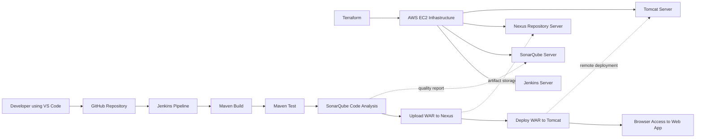

## How the Pipeline Works

The workflow begins when code is pushed to GitHub. Jenkins is configured to pull the repository and execute the `Jenkinsfile`. The pipeline first builds the Java application using Maven, then runs tests. After that, Jenkins sends the project to SonarQube for static code analysis.

If the build and scan complete successfully, Jenkins uploads the generated `.war` artifact to Nexus Repository under the `maven-snapshots` repository. Finally, Jenkins uses the Tomcat manager API to deploy the WAR file to the Tomcat server using the configured context path.

The final application is then accessible in the browser through the Tomcat server.

## Tools and Technologies

| Tool | Purpose |
|---|---|
| AWS EC2 | Hosted Jenkins, SonarQube, Nexus, and Tomcat servers |
| Terraform | Provisioned AWS infrastructure as code |
| Jenkins | Automated the CI/CD pipeline |
| Maven | Built and packaged the Java web application |
| SonarQube | Performed static code quality analysis |
| Nexus Repository | Stored the generated WAR artifact |
| Apache Tomcat 9 | Hosted the deployed Java web application |
| GitHub | Stored the source code and Jenkinsfile |
| Git Bash / PowerShell | Used for Git, SSH, and Terraform commands |
| VS Code | Used for editing project files |

## Repository Structure

```text
.
├── JENKINS/
│   ├── ec2.tf
│   └── install_jenkins.sh
├── NEXUS/
│   └── ec2.tf
├── SONAQUBE/
│   └── ec2.tf
├── SampleWebApp/
│   ├── pom.xml
│   └── src/main/webapp/
├── tomcat/
│   ├── ec2.tf
│   └── install_tomcat.sh
├── docs/
│   └── screenshots/
├── Jenkinsfile
├── .gitignore
└── README.md
```

## Infrastructure Provisioning with Terraform

Terraform was used to create separate AWS EC2 instances for each major service. I used separate folders for each server so I could provision and troubleshoot them independently.

The infrastructure included:

- A Jenkins EC2 instance.
- A SonarQube EC2 instance.
- A Nexus EC2 instance.
- A Tomcat EC2 instance.
- Security groups for required inbound traffic.
- SSH access using the `buildkey` key pair.
- Terraform outputs for service URLs.

### Ports Used

| Service | Port | Reason |
|---|---:|---|
| SSH | 22 | Remote administration |
| Jenkins | 8080 | Jenkins web UI |
| SonarQube | 9000 | SonarQube web UI |
| Nexus | 8081 | Nexus Repository web UI |
| Tomcat | 8080 | Tomcat web UI and deployed app |

## Jenkins Pipeline Stages

The Jenkins pipeline contains five main stages.

### 1. Build with Maven

Jenkins enters the `SampleWebApp` directory and runs Maven to clean, build, test, and package the application.

```groovy
sh 'cd SampleWebApp && mvn clean install'
```

### 2. Test

The test stage runs Maven tests separately so the pipeline has a clear testing stage.

```groovy
sh 'cd SampleWebApp && mvn test'
```

### 3. SonarQube Analysis

This stage sends the project to SonarQube for static analysis. Jenkins uses the configured SonarQube server and token.

```groovy
withSonarQubeEnv('SonarQube') {
    sh '''
    cd SampleWebApp && mvn org.sonarsource.scanner.maven:sonar-maven-plugin:sonar \
      -Dsonar.projectKey=SampleWebApp \
      -Dsonar.projectName=SampleWebApp
    '''
}
```

### 4. Upload Artifact to Nexus

After Maven creates the WAR file, Jenkins uploads it to Nexus Repository.

```groovy
nexusArtifactUploader artifacts: [[
    artifactId: 'SampleWebApp',
    classifier: '',
    file: 'SampleWebApp/target/SampleWebApp.war',
    type: 'war'
]],
credentialsId: 'nexus',
groupId: 'SampleWebApp',
nexusUrl: 'NEXUS_PUBLIC_DNS:8081',
nexusVersion: 'nexus3',
protocol: 'http',
repository: 'maven-snapshots',
version: '1.0-SNAPSHOT'
```

### 5. Deploy to Tomcat

Jenkins deploys the WAR file to Tomcat using the Tomcat manager endpoint.

```groovy
deploy adapters: [
    tomcat9(
        alternativeDeploymentContext: '',
        credentialsId: 'tomcat',
        path: '',
        url: 'http://TOMCAT_PUBLIC_IP:8080/'
    )
],
contextPath: 'myapp',
war: 'SampleWebApp/target/SampleWebApp.war'
```

## Jenkins Plugins Installed

The pipeline required additional Jenkins plugins:

- SonarQube Scanner
- Nexus Artifact Uploader
- Deploy to container
- Pipeline
- Git

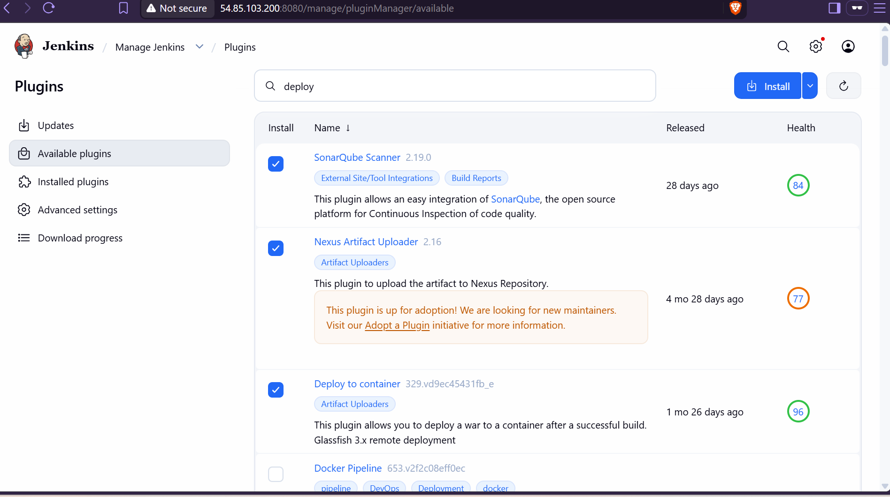

## SonarQube Configuration

SonarQube was installed on a separate EC2 instance and exposed on port `9000`. In Jenkins, I configured a SonarQube server entry and connected it using a SonarQube token stored as a Jenkins secret text credential.

The SonarQube integration required:

- Installing the SonarQube Scanner plugin in Jenkins.
- Generating a token from SonarQube.
- Adding the token to Jenkins credentials.
- Configuring the SonarQube server URL in Jenkins.
- Creating a webhook from SonarQube back to Jenkins.

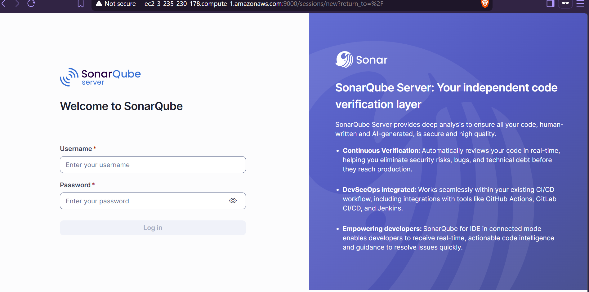

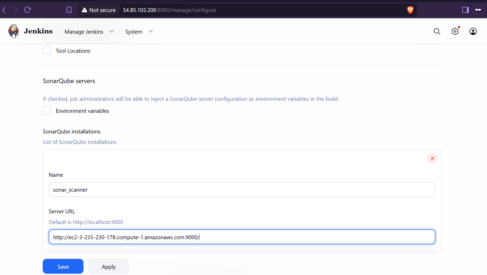

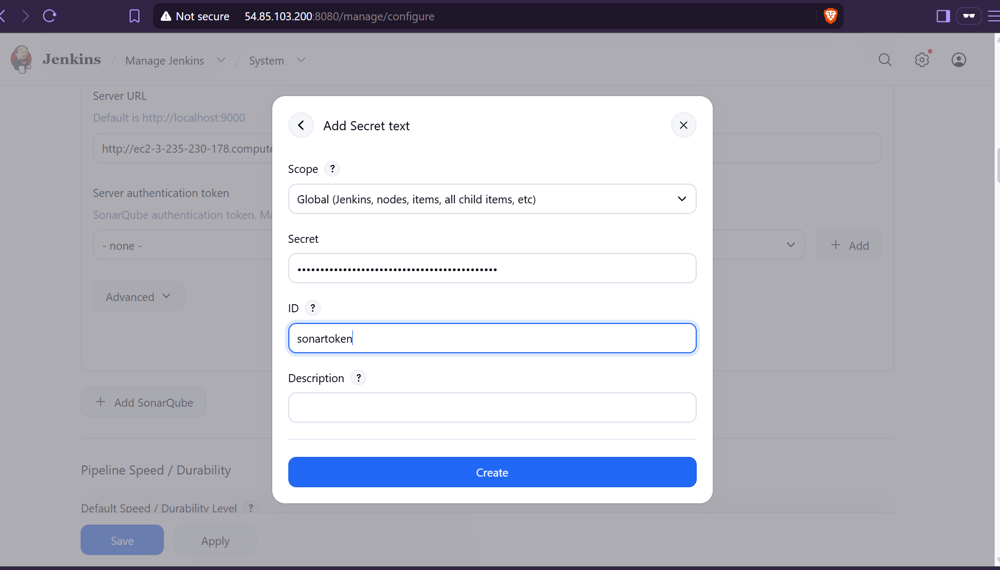

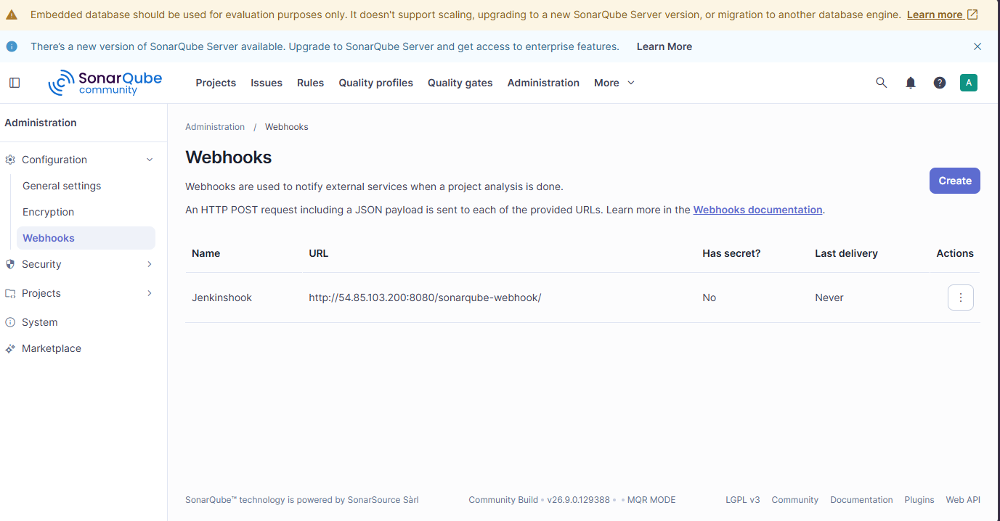

## Nexus Repository Configuration

Nexus was installed on a separate EC2 instance and exposed on port `8081`. Jenkins uploaded the generated WAR file to the `maven-snapshots` repository.

This stage proved that the application artifact was not only built locally inside Jenkins, but also archived in a repository manager for traceability and reuse.

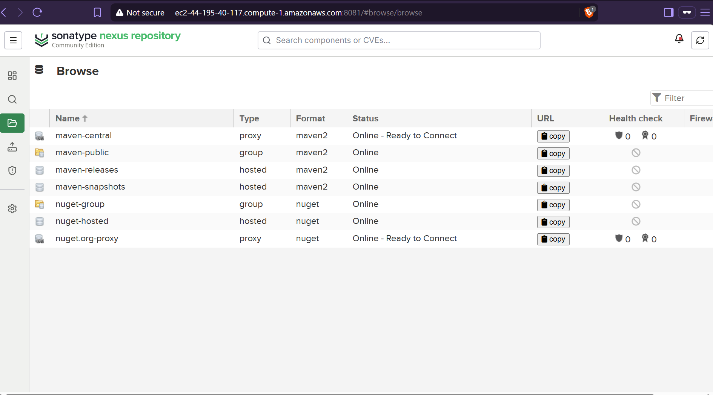

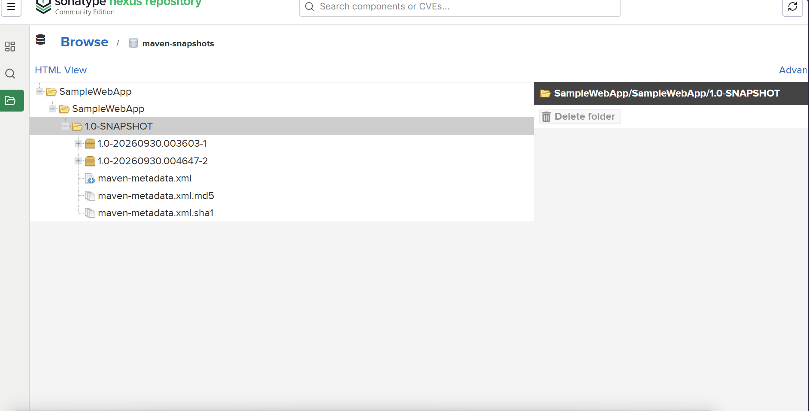

## Tomcat Configuration

Tomcat was installed on a separate EC2 instance and exposed on port `8080`. Jenkins used the Deploy to container plugin to deploy the WAR file remotely.

To allow Jenkins to deploy to Tomcat, I installed the Tomcat manager package and added a user with the `manager-script` role.

```xml
<role rolename="manager-gui"/>
<role rolename="manager-script"/>
<role rolename="admin-gui"/>
<user username="admin" password="REPLACE_WITH_SECURE_PASSWORD" roles="manager-gui,manager-script,admin-gui"/>
```

Tomcat was restarted after the configuration change.

```bash
sudo systemctl restart tomcat9
```

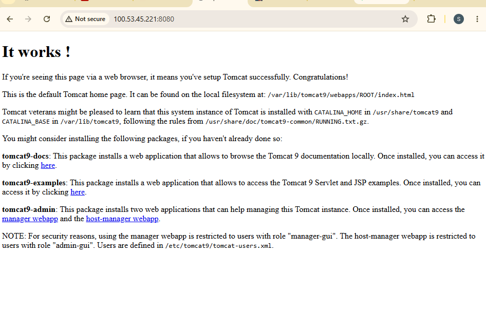

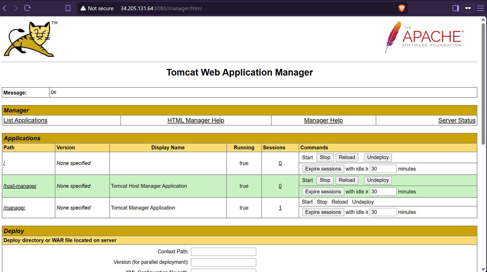

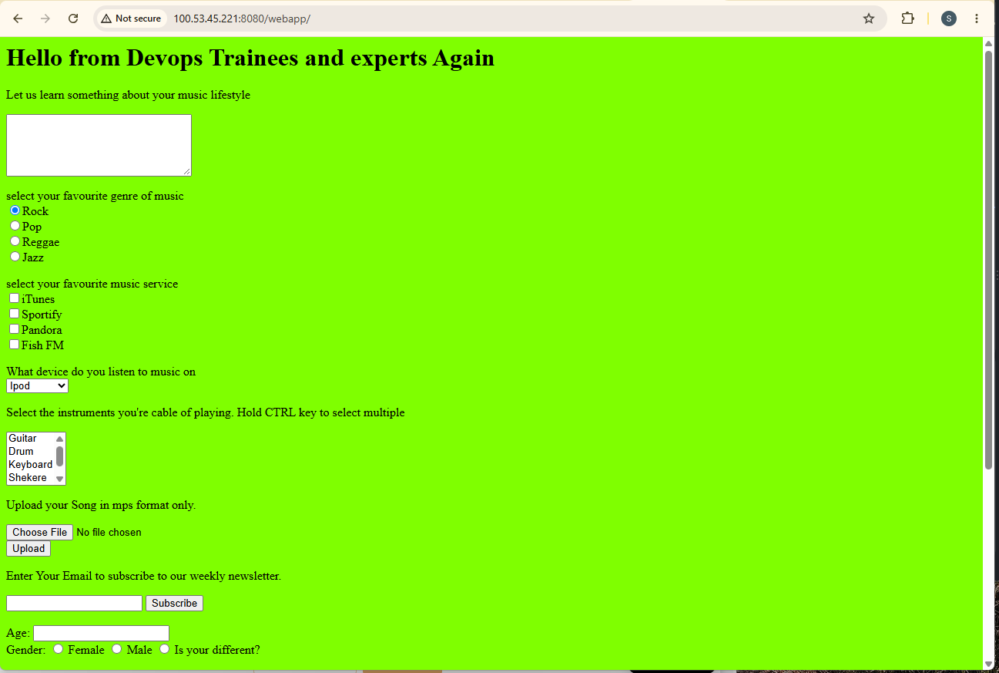

## Final Successful Pipeline

The final Jenkins build completed successfully. Each stage passed:

```text
Build with Maven       SUCCESS
Test                   SUCCESS
SonarQube Analysis     SUCCESS
Upload Artifact Nexus  SUCCESS
Deploy to Tomcat       SUCCESS
```


## Challenges, Errors, and Fixes

This was the most valuable part of the project. The pipeline did not work immediately. Each failure helped me understand how the tools interact.

### 1. Terraform Provider Error

**Problem:** Running `terraform validate` failed because the AWS provider was missing.

**Cause:** The Terraform working directory had not been initialized.

**Fix:** I initialized Terraform first.

```bash
terraform init
terraform validate
```

### 2. AWS Profile Error

**Problem:** Terraform failed because it could not use the configured AWS profile.

**Cause:** The provider profile did not match the AWS profile available locally.

**Fix:** I corrected the AWS CLI configuration and verified access.

```bash
aws configure
aws sts get-caller-identity
```

### 3. Jenkins Was Not Reachable on Port 8080

**Problem:** After provisioning the Jenkins instance, Jenkins did not load in the browser.

**Troubleshooting:** I tested port connectivity. SSH on port `22` worked, but Jenkins on port `8080` failed.

**Fix:** I reviewed the security group and bootstrap script, then corrected the Jenkins installation process.

### 4. Jenkins Installation Script Problems

**Problem:** Jenkins did not install cleanly at first.

**Causes:**

- The script needed a proper Bash header.
- Jenkins required a newer Java version.
- The Jenkins package signing key needed to be configured correctly.

**Fix:** I updated the Jenkins bootstrap script to install Java 21, configure the Jenkins repository, install Jenkins, and start the service.

### 5. Maven WAR Plugin Failure

**Problem:** Maven failed with this error:

```text
Cannot access defaults field of Properties
maven-war-plugin:2.2
```

**Cause:** Maven was using an old WAR plugin version that was incompatible with the Java/Maven environment.

**Fix:** I added a newer Maven WAR plugin version in `pom.xml`.

```xml
<plugin>
  <groupId>org.apache.maven.plugins</groupId>
  <artifactId>maven-war-plugin</artifactId>
  <version>3.4.0</version>
</plugin>
```

### 6. Wrong Jenkins Shell Command

**Problem:** I originally used this command:

```bash
cd SampleWebApp mvn test
```

**Cause:** I combined `cd` and `mvn` incorrectly.

**Fix:** I used `&&` so Maven only runs after entering the correct directory.

```bash
cd SampleWebApp && mvn test
```

### 7. SonarQube Startup Failure

**Problem:** SonarQube did not start correctly at first.

**Causes:**

- One download URL returned `403 Forbidden`.
- The SonarQube startup script needed execute permission.
- SonarQube required Java 21.

**Fix:** I corrected the download, made the startup script executable, installed Java 21, and restarted SonarQube.

```bash
sudo chmod +x /opt/sonarqube/bin/linux-x86-64/sonar.sh
sudo apt install -y openjdk-21-jdk
sudo update-alternatives --config java
sudo systemctl restart sonarqube
```

### 8. Jenkins Could Not Find SonarQube Installation

**Problem:** Jenkins failed with:

```text
SonarQube installation defined in this job does not match any configured installation
```

**Cause:** The SonarQube name in Jenkins did not match the name used in the Jenkinsfile.

**Fix:** I configured the SonarQube server in Jenkins and matched the name used in the pipeline.

```groovy
withSonarQubeEnv('SonarQube')
```

### 9. Maven Could Not Resolve `sonar:sonar`

**Problem:** Maven failed with:

```text
No plugin found for prefix 'sonar'
```

**Cause:** Maven did not automatically resolve the Sonar plugin prefix.

**Fix:** I used the full plugin coordinate.

```bash
mvn org.sonarsource.scanner.maven:sonar-maven-plugin:sonar
```

### 10. Jenkinsfile Syntax Error

**Problem:** Jenkins failed with:

```text
unexpected token: }
```

**Cause:** A brace was misplaced while editing the Jenkinsfile.

**Fix:** I rewrote the Jenkinsfile with a clean balanced structure.

### 11. Nexus Upload Failed with 401 Unauthorized

**Problem:** Nexus upload failed with:

```text
401 Unauthorized
```

**Cause:** Jenkins could reach Nexus, but the Nexus credential was incorrect or missing.

**Fix:** I updated the Jenkins credential with ID `nexus` using the correct Nexus username and password.

### 12. Tomcat Deployment Failed with 404

**Problem:** Tomcat deployment failed with:

```text
/manager/text/list
HTTP Status 404 - Not Found
```

**Cause:** Jenkins deploys through the Tomcat manager text endpoint, but the Tomcat manager package was not installed/enabled.

**Fix:** I installed `tomcat9-admin`, configured a Tomcat user with `manager-script`, and restarted Tomcat.

```bash
sudo apt update
sudo apt install -y tomcat9-admin
sudo systemctl restart tomcat9
```

### 13. Git Push Rejected

**Problem:** Git rejected my push because the remote repository had changes that were not in my local branch.

**Fix:** I rebased my local branch before pushing.

```bash
git pull --rebase origin main
git push
```

### 14. Terraform State Files Appeared Locally

**Problem:** Terraform created `.terraform` folders and state files locally.

**Fix:** I added Terraform files to `.gitignore`.

```gitignore
**/.terraform/
**/terraform.tfstate
**/terraform.tfstate.backup
**/*.tfstate
**/*.tfstate.*
```

## Screenshot Evidence

| Evidence | Screenshot |
|---|---|
| Jenkins plugins installed |  |
| Jenkins SCM pipeline configuration | 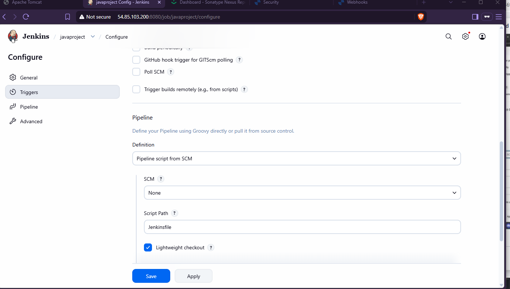 |
| Jenkins SonarQube server configuration |  |
| SonarQube webhook created |  |
| Nexus repositories online |  |
| Nexus artifact uploaded |  |
| Tomcat Manager enabled |  |
| Tomcat web app deployed |  |
| Jenkins deployment stage successful |  |

## What I Learned

Through this project, I learned how to:

- Use Terraform to provision AWS EC2 infrastructure.
- Install and configure Jenkins, SonarQube, Nexus, and Tomcat.
- Build a Maven Java web application in Jenkins.
- Integrate SonarQube code analysis into a Jenkins pipeline.
- Store build artifacts in Nexus Repository.
- Deploy a WAR file remotely to Tomcat.
- Configure Jenkins credentials for external tools.
- Debug CI/CD failures by reading console output carefully.
- Use screenshots and logs as documentation evidence.
- Clean up cloud resources after the project to avoid unnecessary AWS cost.

## Security and Cost Notes

The EC2 instances used for this project were destroyed after the pipeline was completed and documented. This helped prevent unnecessary AWS charges and reduced exposure of temporary public services.

For production, I would improve the setup by:

- Restricting security group access to trusted IP addresses.
- Using HTTPS for Jenkins, SonarQube, Nexus, and Tomcat.
- Storing secrets in a secure secrets manager.
- Using stronger passwords and rotating credentials.
- Using a remote backend for Terraform state.
- Running SonarQube with an external production database instead of the embedded database.
- Adding a quality gate wait stage before artifact upload and deployment.

## Project Status

Completed successfully.

The final pipeline built the Java application, tested it, scanned it with SonarQube, uploaded the WAR artifact to Nexus, and deployed the web application to Tomcat.
